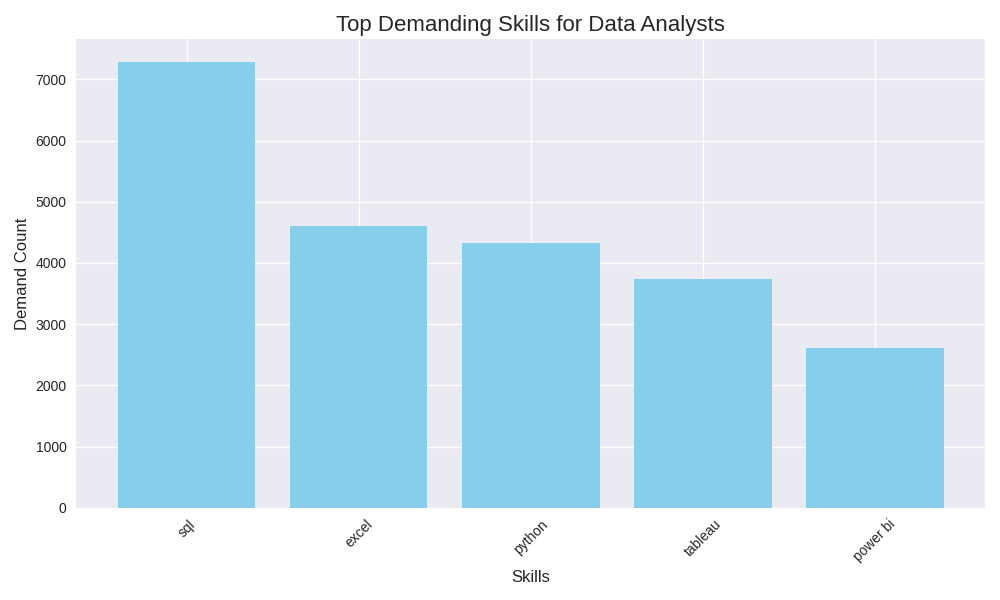
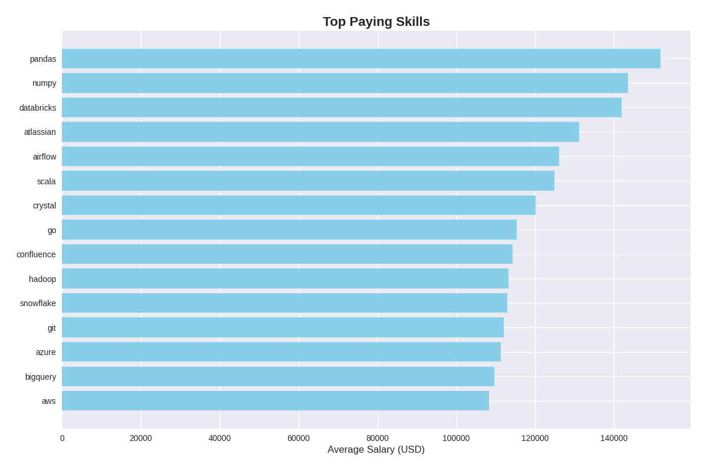
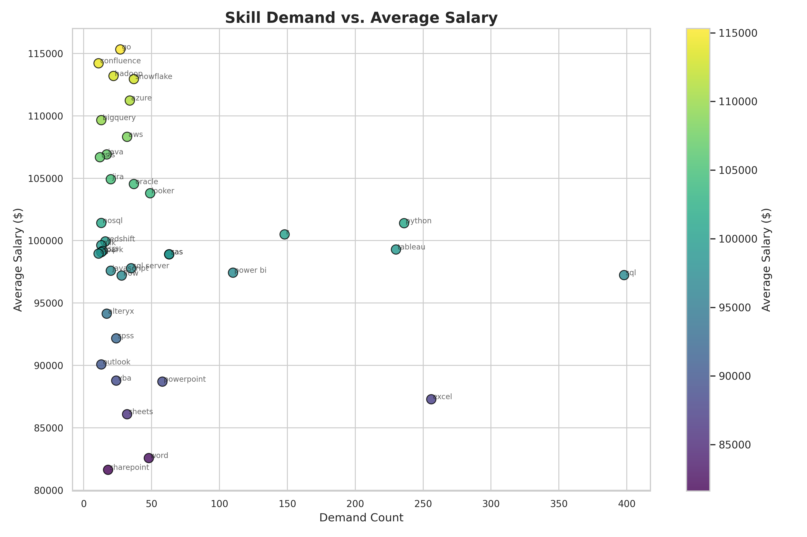

# Introduction
Want to dive into the job market for Data Analysts? This project will help showcase the answers to the question of 'What is needed to know about Data Analysts'. This project will provide the skills, the pay, and the job postings for Data Analysts.

SQL queries? Check them out here:
    [project_sql folder](/project_sql/)
# Background
Determined to learn more about Data Analysts job market more effectively, this project was created from a desire to learn more about SQL and the analysis of data. This project will be able to show the viewer the top-paid jobs and in-demand skills need for Data Analysts.

Data hails from my [SQL Course](https://lukebarousse.com/sql). It's packed with insights on job titles, salaries, locations and essential skills.

### The Questions I Wanted to Solve Through My SQL Queries Were:
1. What are the top-paying data analyst jobs that are remote or in CA?
2. What skills were required for these top-paying jobs?
3. What skills are most in-demand for Data Analysts?
4. Which skills are connected with higher paying jobs?
5. What is the best skill to learn to get a Data Analyst job?

# Tools I Used
To help create this project, these are the following tools I used:
- **SQL**: Allowed me to query the database for analysis. Helped create insights and collected data that was needed to answer the questions.
- **PostgreSQL**: Chosen database management system to handle the job postings data provided.
- **VS Code**: The IDE used to write and execute my queries in.
- **Git & GitHub**: To share my SQL scripts and analysis, allowing organization and project tracking.

# The Analysis
Each query for this project was specifically made to investigate specific aspects of the Data Analyst job market. Here's how I approached each question:

### 1. Top Paying Data Analyst Jobs
To find out the highest paying job, I filtered Data Analyst positions by average yearly salary and location, focusing on either remote jobs or jobs located in California. This query will then showcase the high-paying jobs in order for the specific field of Data Analyst.

```sql
SELECT
    job_id,
    name AS company_name,
    job_title,
    job_location,
    job_schedule_type,
    salary_year_avg,
    job_posted_date
FROM job_postings_fact AS job_postings
LEFT JOIN company_dim AS company ON company.company_id = job_postings.company_id
WHERE
    job_title_short = 'Data Analyst' AND
    (job_work_from_home = TRUE OR job_location LIKE '%CA') AND
    salary_year_avg IS NOT NULL
ORDER BY
    salary_year_avg DESC
LIMIT 50;
```

Breakdown of the top Data Analyst jobs in 2023:

- **Wide Salary Range**: Top 50 Data Analyst salaries ranged from $170,000 to $650,000. This data shows the potential salaries a Data Analyst can achieve.
- **Diverse Companies**: Many different companies were offering Data Analyst jobs. From Meta, TikTok, Walmart, and AT&T showing the diversity this job offers.
- **Job Titles**: There are high diversity roles of Data Analysts, reflecting the possiblites of different specialization within data analytics.

### 2. Skills For Top Paying Jobs
By joining the top-paying Data Analyst job postings with their associated skill, this query surfaces the skills most commonly required by employers offering the highest salaries.

```sql
WITH top_paying_jobs AS (
    SELECT
        job_id,
        name AS company_name,
        job_title,
        salary_year_avg
    FROM job_postings_fact AS job_postings
    LEFT JOIN company_dim AS company ON company.company_id = job_postings.company_id
    WHERE
        job_title_short = 'Data Analyst' AND
        (job_location LIKE 'Anywhere' OR job_location LIKE '%CA') AND
        salary_year_avg IS NOT NULL
    ORDER BY
        salary_year_avg DESC
    LIMIT 50
)

SELECT
    top_paying_jobs.*,
    skills.skills
FROM 
    top_paying_jobs
INNER JOIN skills_job_dim AS job_skills ON job_skills.job_id = top_paying_jobs.job_id
INNER JOIN skills_dim AS skills ON skills.skill_id = job_skills.skill_id
ORDER BY 
    salary_year_avg DESC;
```
Breakdown for common skills in high paying jobs in 2023:
- **SQL**: After analysis it seems SQL is often shown across multiple top-paying roles, showing the importance of this skill.
- **Python**: Python comes next as a common skill being used in higher pay jobs to help analyze and automate work.
- **Tableau**: Tableau highlights the importance of knowing a skill to be able to communicate insights with stakeholders using visualization.

### 3. In-Demand Skills for Data Analyst Jobs
This query was created to help find the top 5 skills that were frequently being listed under Data Analyst jobs.

```sql
SELECT
    skills,
    COUNT(job_skills.job_id) AS demand_count
FROM
    job_postings_fact AS job_postings
INNER JOIN skills_job_dim AS job_skills ON job_skills.job_id = job_postings.job_id
INNER JOIN skills_dim AS skills ON skills.skill_id = job_skills.skill_id
WHERE
    job_title_short = 'Data Analyst' AND
    job_work_from_home = TRUE
GROUP BY
    skills
ORDER BY
    demand_count DESC
LIMIT 5;
```

*Visual Insights helped created  by Co-Pilot*

Breakdown of the most in-demand skills for Data Anaylsts in 2023:
- **SQL & Python**: Are the top two languages that are in-demand for Data Analyst jobs that are work from home.
- **Excel, Tableau, PowerBI**: Are essential tools for data analyzing and data storytelling.

### 4. Skills Based on Salary
Exploring the average salaries for different types of skills to see what skills are the highest pay.

```sql
SELECT
    skills,
    ROUND(AVG(salary_year_avg), 0) AS avg_salary
FROM
    job_postings_fact AS job_postings
INNER JOIN skills_job_dim AS job_skills ON job_skills.job_id = job_postings.job_id
INNER JOIN skills_dim AS skills ON skills.skill_id = job_skills.skill_id
WHERE
    job_title_short = 'Data Analyst' AND
    salary_year_avg IS NOT NULL
    AND job_work_from_home = TRUE
GROUP BY
    skills
ORDER BY
    avg_salary DESC
LIMIT 25;
```

*Top 10 skills most commonly associated with higher average salaries created by Co-Pilot*

Breakdown of the results of top paying skills for Data Analysts:

- **Advanced Python & Data Engineering**: Skills like pandas, numpy, databricks are high skills that are needed in companies that work with large datasets. Given that these skills are linked to high salaries, it shows insights on how much companies would pay for knowing these advanced skills.
- **Cloud & Platform Experience**: Skills like Databricks, Snowflake, Azure both have high salaires and high job counts, suggest that cloud proficiency help boosts earning potential for Data Analyst jobs.

### 5. Most Optimal Skills to Learn
Combining skill demand and salary data. This query showcases skill demand count and their association to its high salary, allowing job seekers to see what skills to focus on if they want high salaries.

```sql
SELECT
    skills.skill_id,
    skills.skills,
    COUNT(job_skills.job_id) AS demand_count,
    ROUND(AVG(job_postings.salary_year_avg), 0) AS avg_salary
FROM 
    job_postings_fact AS job_postings
INNER JOIN skills_job_dim AS job_skills ON job_skills.job_id = job_postings.job_id
INNER JOIN skills_dim AS skills ON skills.skill_id = job_skills.skill_id
WHERE
    job_title_short = 'Data Analyst'
    AND salary_year_avg IS NOT NULL
    AND job_work_from_home = TRUE
GROUP BY
    skills.skill_id
HAVING
    COUNT(job_skills.job_id) > 10
ORDER BY
    avg_salary DESC,
    demand_count DESC
LIMIT 25;
```

*Visual Insight created by Co-Pilot*

Breakdown of optimal skills for high salaries in 2023:
- **Cloud and Data Skills**: Skills such as Go, Snowflake, and Azure appear near the top of the table for higher average salaries. These skills are usually used in large scaled data environments contributing to the reason why these skills offer high salaries, but aren't highly demanded for Data analyst jobs
- **Visualization**: Even though visualization is a key part in Data Analyst jobs, skills like powerBI with a demand count of 110 have an average salary of $97,431. A salary that isn't too high, but still a fundamental skill to have.

# What I Learned
Here are some key concepts I learned when working on this project:
- **Complex Query**: Improved my ability to write complex SQL queries by correctly joining multiple tables, using Common Table Expressions (CTEs) and selecting appropriate join types to answer analytical questions accurately.
- **Data Aggregation**: Gained hands on experience using aggregation functions such as GROUP BY, COUNT, AVG, and SUM to summarize large datasets and extract patterns from the job  market.
- **Analyzing**: Learned how to translate business questions into SQL queries and interpret query results to generate actionable insights.

# Conclusions
### Insights
From the analysis, here are some general insights found:
- **Most in Demand Skill**: SQL is the most in-demand skill for Data Analyst roles. This aligns with expectations, as extracting, transforming and querying data from databases is a core responsibility of a Data Analyst, making SQL a foundational skill to master!
- **Top Paying Skills**: Many of the highest paying skills are related to cloud platforms and data infrastructure technologies. While these skills are not traditionally associated with entry-level Data Analyst roles, their prescence in higher-paying jobs involve working with large datasets and complex systems.
- **Skill Differentiation**: Foundational skills like SQL, Python and Tableau are required across most roles, but they don't differentiate in salary. While in contrast, specialized skills that relate to cloud computing are more commonly seen in higher salaries.

### Closing Thoughts
Through this project, I strengthened my SQL skills while uncovering meaningful insights into the Data Analyst job market in 2023. By analyzing skill demands and salary trends, this project provides guidance for job seekers looking to enter or advance in Data Analyst roles. The findings help identify which skills to prioritize for career growth and set realistic expectations around compensation in today's job market.
